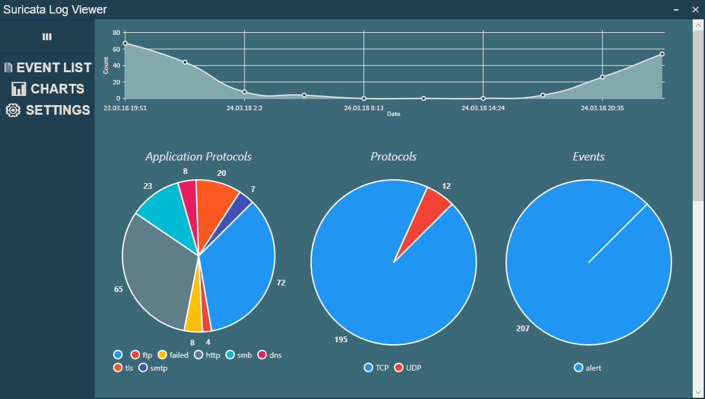
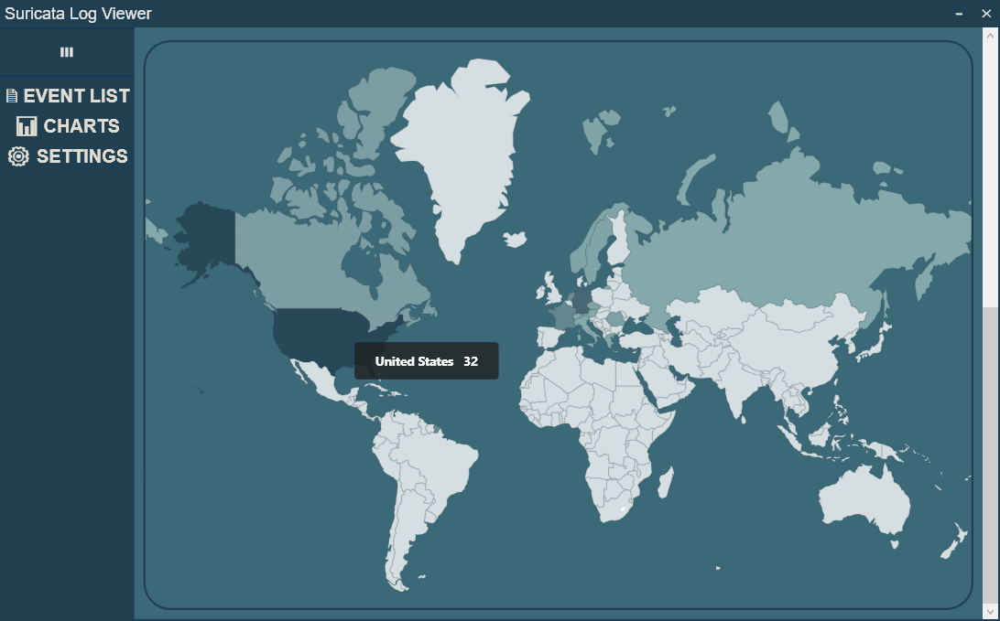
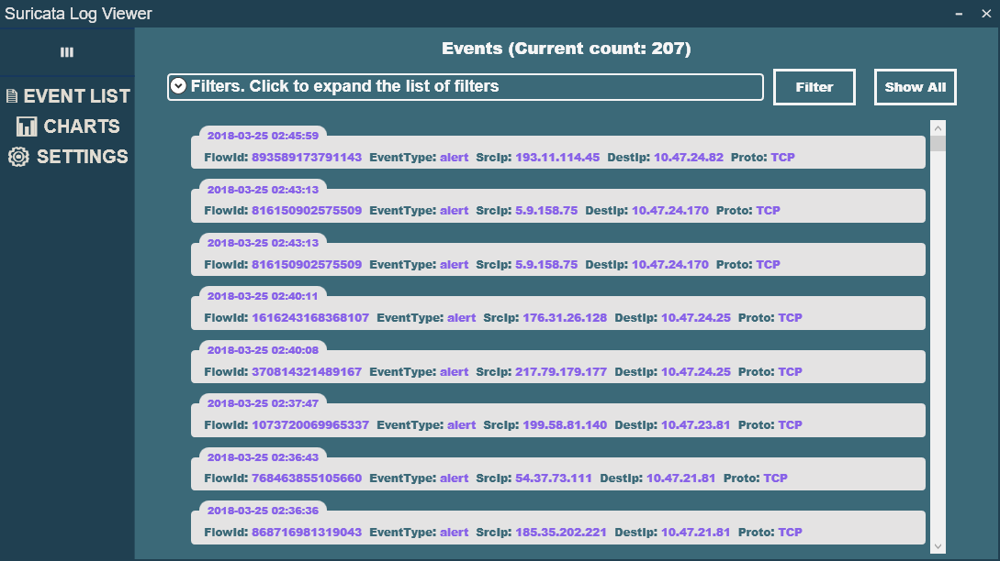
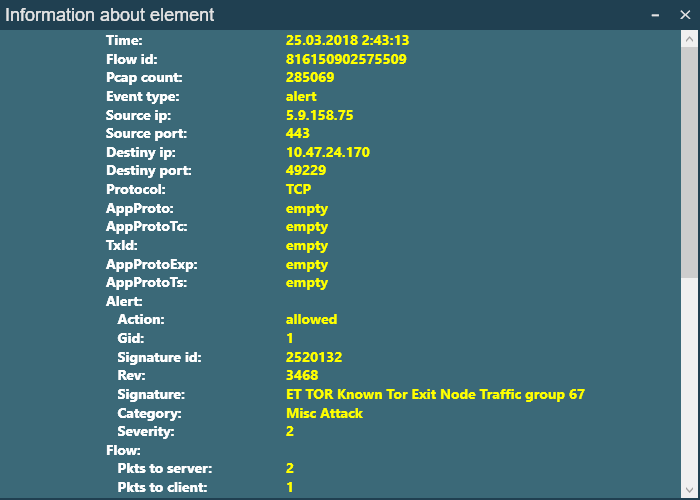

# SuricataLogViewer
###  Simple Suricata Log Viewer Application

# Features
* ### Charts

* ### GeoMap

* ### Event list with the ability to filter events by their parameters

* ### Detailed list of parameters of the selected event

